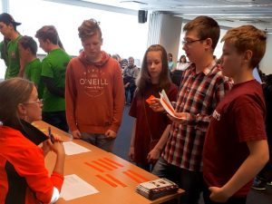

# CV Renāra Gausiņš CV

---
Tas esmu es Renārs Gausiņš un man ir 17 gadi. Interesējos par datoriem no četru gadu vecuma, un jau divus gadu kā nodarbojos ar mājaslapu izveidi uz Python Django. Esmu iesaistijies viss visādās programmēšanas sfērās robotika, spēļu izveide, programmu izveidi u.t.t.

# Kods

```
import pyautogui
import time

time.sleep(10)

status = 0

for x in range(0, 300):
    pyautogui.click()
```    


Šī ir programma kas pati spiež uz cookie clicker cepuma. Šo programmu rakstīju kaut kur pusgadu atpakaļ.

Man ļoti patīk piedalīties viss visādos konkursos. Kad gāju 4. klasē mani ieinteresēja robotika kur vajadzēja taisīt robotus un algoritmus tiem. 4. klases beigās man bija pietiekami daudz pieredzes pēc skolotāja teiktā ka varu piedalīties sumo botu sacensībās, un kaut kur no ~100 vai vairāk dalībniekiem, es ar savu komandas biedru ieguvām septīto vietu Latvijā. Tikai tagad esmu sācis saprast cik tas ir forši. 

---
Šeit var redzēt kur piedalos vienā no citiem konkursiem kas nav saistīts ar datortehniku.


# Projekti:
1. SodiumNitartes blog
2. Discord bot Foozie
3. Muzon reklāmu mājaslapa
4. Miten spēļu tornamentu mājaslapa

# Saprotu/pārzinu/protu:
- [x] Python, HTML un CSS pamati.
- [x] Framework Django :+1:
- [ ] Front-end
- [x] Back-end
- [ ] JavaScript

# Īsumā
| Vārds | Uzvārds | Vecums | Prog. valoda | Pieredze (laiks) |
| ----------- | ----------- | ----------- | ----------- | ----------- |
| Renārs | Gausiņš | 17 | Python | 2 gadi |
